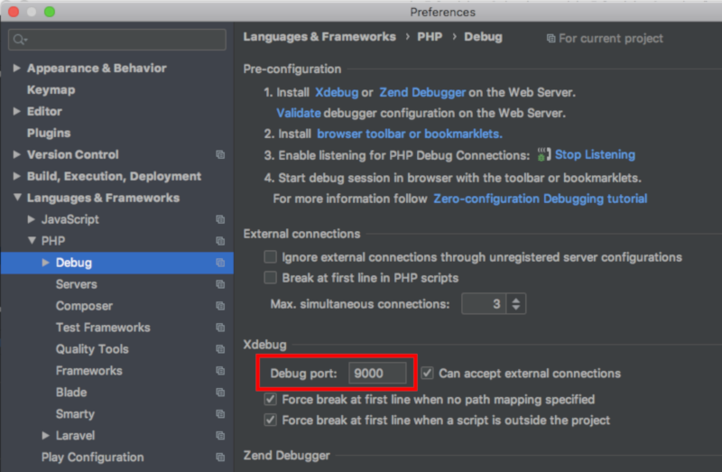
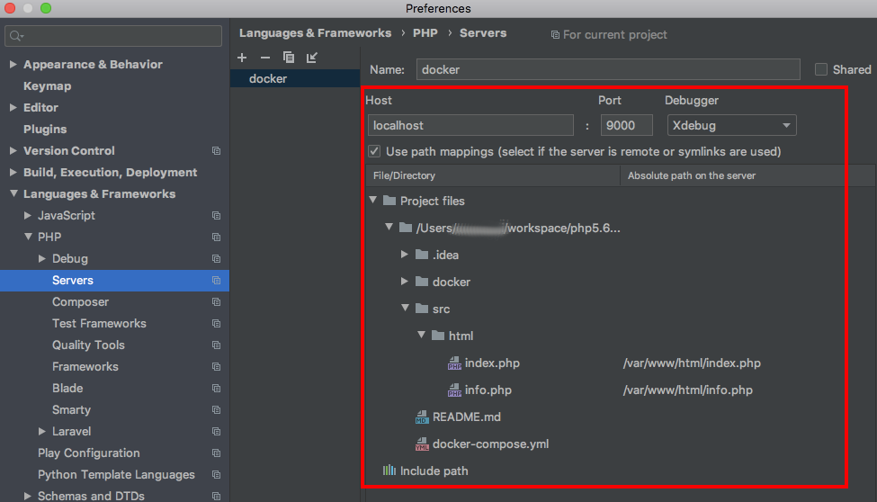
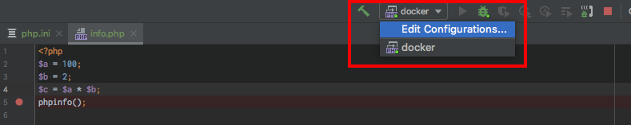
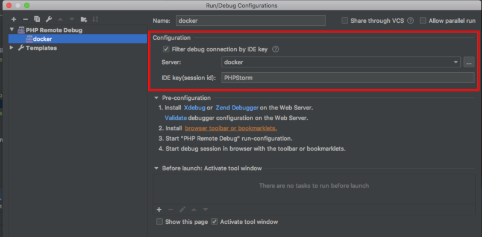
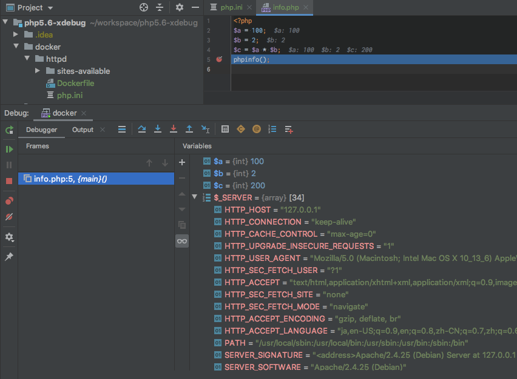

# php5.6環境にxdebugをインストールしてみる

## 前提条件

- Mac環境
- [Docker Desktop for Mac](https://hub.docker.com/editions/community/docker-ce-desktop-mac)をインストール済み
- Gitをインストール済み

## コード配置
githubから必要なコードを配置する。
```
$ mkdir -p ~/workspace/php5.6-xdebug && cd ~/workspace/php5.6-xdebug
$ git clone https://github.com/reflet/php5.6-xdebug.git .
```

## docker準備
dockerイメージを作成する。
```
$ docker-compose build
```

## サーバ起動
docker-composeを使ってサーバを起動します。
```
$ docker-compose up -d
```

## IntelliJ設定
IDEにXdebugが使えるように設定をする。

- **Preferences > Languages & Frameworks > PHP > Debug**


- **Preferences > Languages & Frameworks > PHP > Servers**


- **edit-configurationsボタン**


- **configurations設置**


- **実行してみる**


## 参考サイト
- [phpstorm/php-56-apache-xdebug-25](https://hub.docker.com/r/phpstorm/php-56-apache-xdebug-25/dockerfile/)
